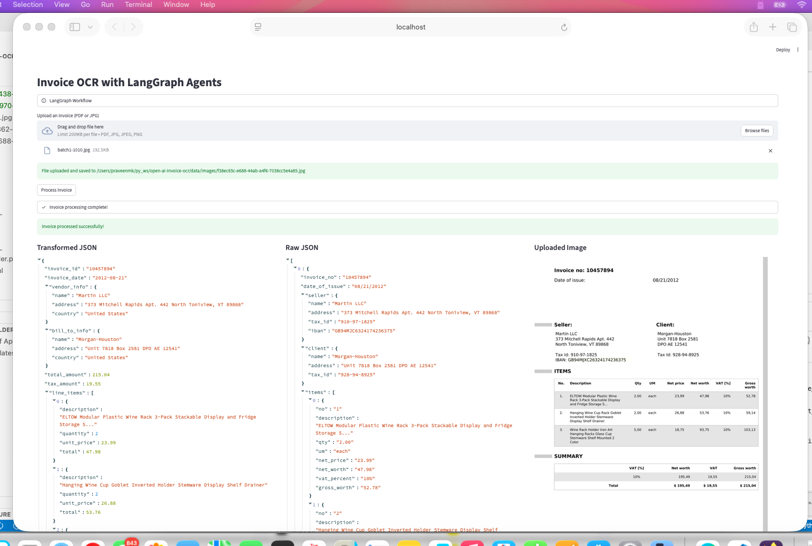

## POC for Image-to-Text task using an LLM 

Modified code with reference to the OpenAI Cookbook 
- https://cookbook.openai.com/examples/data_extraction_transformation

## LLM Dependency
One of the below would be needed
- OpenAI ApiKey in .env (gpt4-o-mini) https://platform.openai.com/docs/models/gpt-4o-mini
- Ollama local with Gemma 3 [[https://ollama.com/library/gemma3]] (vision capability), Llamma 3  [[https://ollama.com/library/llama3]]

Note : code change needed on OpenAI object initialization 

## Screenshots
Example - UI
