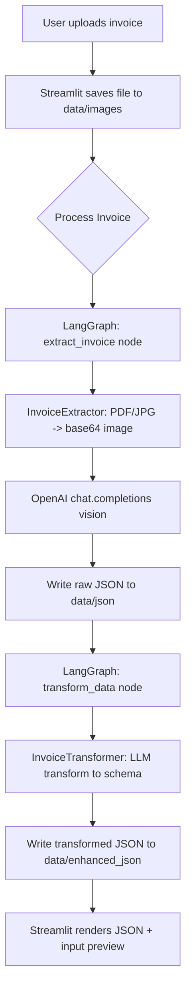
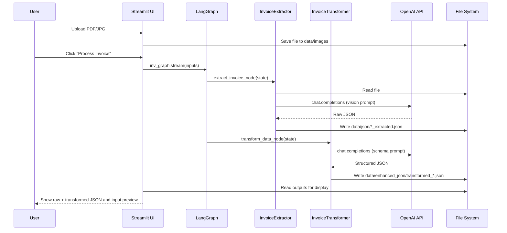
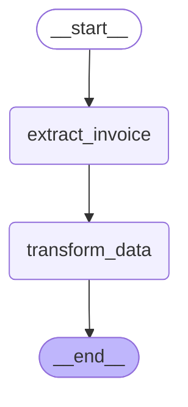

## POC for Image-to-Text task using an LLM 

Modified code with reference to the OpenAI Cookbook 
- https://cookbook.openai.com/examples/data_extraction_transformation

## LLM Dependency
One of the below would be needed
- OpenAI ApiKey in .env (gpt4-o-mini) https://platform.openai.com/docs/models/gpt-4o-mini
- Ollama local with Gemma 3 [[https://ollama.com/library/gemma3]] (vision capability), Llamma 3  [[https://ollama.com/library/llama3]]

Note : code change needed on OpenAI object initialization 

## Technical Documentation

### Purpose
This project is a Streamlit-based invoice OCR pipeline that uses a LangGraph workflow to:
1) extract raw invoice data from an uploaded PDF/JPG using an LLM with vision, and
2) transform that raw JSON into a structured schema.

### High-Level Architecture
- UI entrypoint: `src/streamlit_app.py` provides file upload, status updates, and JSON previews.
- Workflow orchestration: `src/inv_graph.py` defines a two-node LangGraph state machine.
- Extraction: `src/tasks/invoice_extractor.py` converts PDFs to images, base64 encodes inputs, and calls the LLM with system/user prompts to get raw JSON.
- Transformation: `src/tasks/transform_data.py` prompts the LLM to normalize the raw JSON into the target schema.
- Node glue code: `src/agents/agents.py` binds extractor/transformer into LangGraph nodes and writes outputs.

### Runtime Data Flow (Flowchart)

### Runtime Interaction (Sequence Diagram)

### Key Files and Directories
- `src/streamlit_app.py`: UI, file handling, and graph invocation.
- `src/inv_graph.py`: LangGraph workflow definition.
- `src/agents/agents.py`: Node implementations and output persistence.
- `src/tasks/invoice_extractor.py`: PDF/JPG preprocessing + extraction prompt.
- `src/tasks/transform_data.py`: Schema-based transformation prompt.
- `src/prompts/prompts.yaml`: Prompt templates used for extraction/transform.
- `src/schemas/`: Target schema definitions for transformed output.
- `data/images/`: Uploaded source files.
- `data/json/`: Raw extraction outputs.
- `data/enhanced_json/`: Transformed outputs.

## Screenshots
Example - UI

